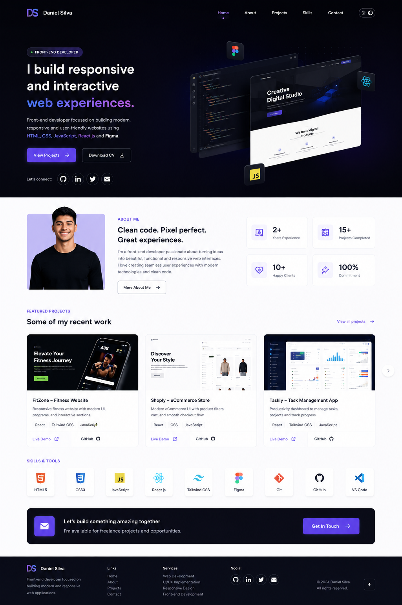
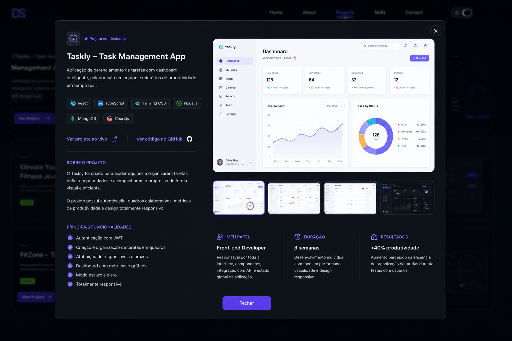
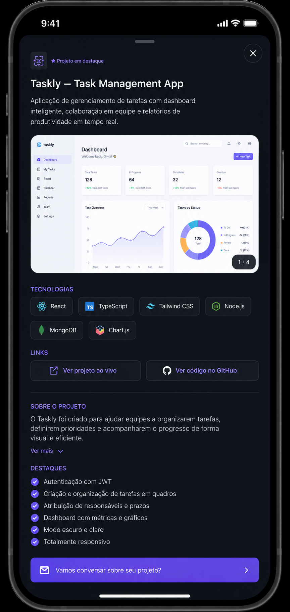

# 🧑‍💻 João — Portfólio Pessoal

> Portfólio pessoal desenvolvido com Next.js 15 e TypeScript, apresentando projetos, habilidades e formas de contato.


---

## 📋 Sobre o projeto

Site portfólio desenvolvido para apresentar minha trajetória como desenvolvedor front-end, com foco em React e TypeScript. O design foi criado do zero com dark theme, modal de detalhes de projetos e layout totalmente responsivo (desktop e mobile).

O projeto serve como vitrine dos meus trabalhos reais e como estudo prático de Next.js 15 com App Router.

---

## ✨ Funcionalidades

- **Hero section** com apresentação e links para projetos e currículo
- **Seção About** com estatísticas de experiência
- **Grid de projetos** com cards interativos
- **Modal de projeto** com screenshots, tecnologias, funcionalidades e métricas
- **Seção de Skills** com ícones das tecnologias
- **Dark/Light mode** com persistência de preferência
- **Layout responsivo** — mobile, tablet e desktop
- **Animações suaves** com Framer Motion

---

## 🛠️ Tecnologias

| Tecnologia                                                | Uso                              |
| --------------------------------------------------------- | -------------------------------- |
| [Next.js 15](https://nextjs.org/)                         | Framework principal (App Router) |
| [TypeScript](https://www.typescriptlang.org/)             | Tipagem estática                 |
| [Tailwind CSS](https://tailwindcss.com/)                  | Estilização                      |
| [Framer Motion](https://www.framer.com/motion/)           | Animações                        |
| [next-themes](https://github.com/pacocoursey/next-themes) | Dark/Light mode                  |
| [Embla Carousel](https://www.embla-carousel.com/)         | Carrossel de screenshots         |
| [react-icons](https://react-icons.github.io/react-icons/) | Ícones de tecnologias            |

---

## 📁 Estrutura do projeto

```
src/
├── app/
│   ├── layout.tsx          # Layout raiz, fontes e ThemeProvider
│   ├── page.tsx            # Página principal (composição das seções)
│   └── globals.css         # Estilos globais e tokens CSS
│
├── components/
│   ├── layout/
│   │   ├── Navbar.tsx
│   │   └── Footer.tsx
│   ├── sections/
│   │   ├── Hero/
│   │   ├── About/
│   │   ├── Projects/
│   │   │   ├── index.tsx
│   │   │   ├── ProjectCard.tsx
│   │   │   └── ProjectModal.tsx
│   │   ├── Skills/
│   │   └── Contact/
│   └── ui/
│       ├── Badge.tsx
│       ├── Button.tsx
│       └── ThemeToggle.tsx
│
├── data/
│   ├── projects.ts         # Dados dos projetos
│   └── skills.ts           # Lista de tecnologias
│
├── types/
│   └── index.ts            # Interfaces TypeScript
│
└── hooks/
    └── useModal.ts         # Estado do modal
```

---

## 🚀 Como rodar localmente

### Pré-requisitos

- Node.js 18+
- npm ou yarn

### Instalação

```bash
# Clone o repositório
git clone https://github.com/joaoemanuels/portfolio.git

# Entre na pasta do projeto
cd portfolio

# Instale as dependências
npm install

# Inicie o servidor de desenvolvimento
npm run dev
```

Acesse [http://localhost:3000](http://localhost:3000) no navegador.

### Scripts disponíveis

```bash
npm run dev       # Inicia em modo desenvolvimento
npm run build     # Gera o build de produção
npm run start     # Inicia o servidor de produção
npm run lint      # Roda o ESLint
```

---

## 📦 Projetos apresentados

| Projeto             | Descrição                            | Tecnologias                 |
| ------------------- | ------------------------------------ | --------------------------- |
| **AgendaPro**       | Sistema de agendamento online        | React, JavaScript, Supabase |
| **PauloViagens**    | Sistema de viagem e rastreio ao vivo | React, Javascript, mapBox   |
| **Decisio**         | Ferramenta de tomada de decisão      | React, Tailwind CSS         |
| **GitHub Explorer** | Explorador de perfis do GitHub       | React, Vite, GitHub API     |

---

## 📱 Screenshots

<div align="center">

  
  
  <br/>
  
  <table>
    <tr>
      <td align="center"><b>Modal — Desktop</b></td>
      <td align="center"><b>Modal — Mobile</b></td>
    </tr>
    <tr>
      <td></td>
      <td></td>
    </tr>
  </table>

</div>

---

## 📬 Contato

**João ** — Desenvolvedor Front-end

[](https://linkedin.com/in/joaoemanuels)
[](https://github.com/joaoemanuels)
[](mailto:jemanuel.pi@email.com)

---

<p align="center">Feito com ❤️ por João </p>
